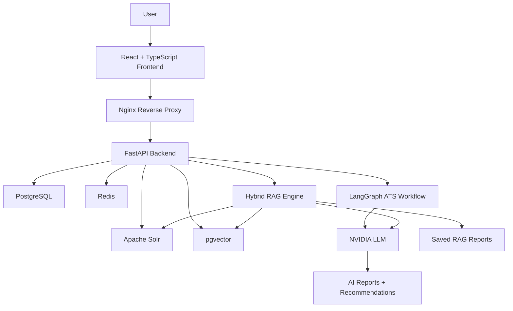
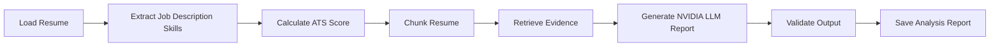
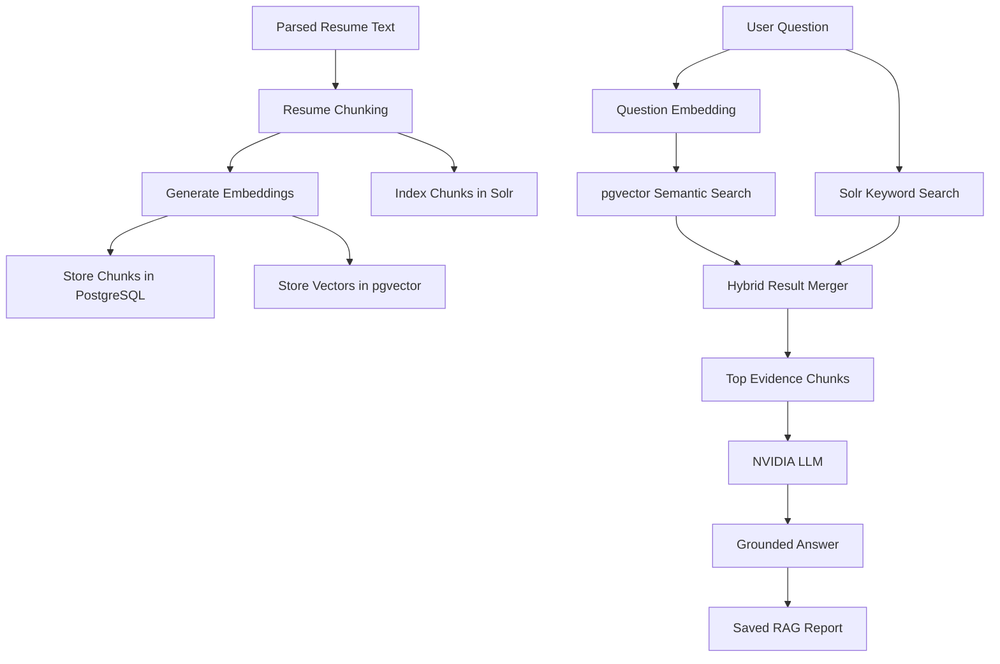
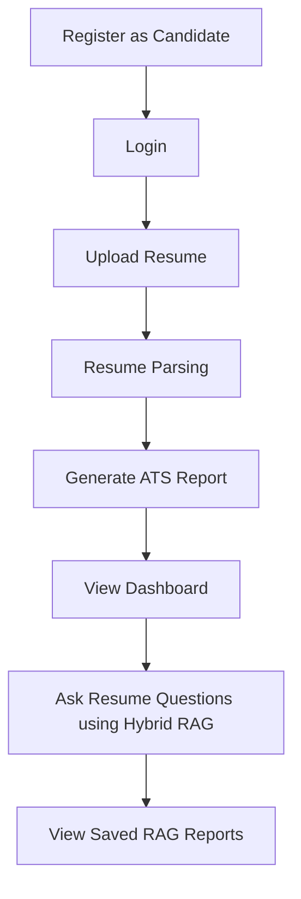
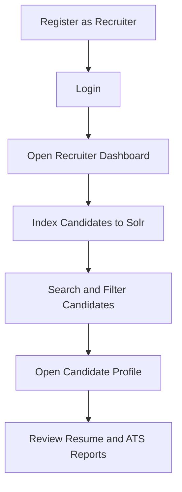

# SkillSync AI

<div align="center">

# 🚀 SkillSync AI  
### AI-Powered Resume Intelligence Platform for Candidates and Recruiters

SkillSync AI is a production-ready full-stack AI platform that helps candidates analyze resumes, improve ATS scores, identify missing skills, ask questions about their resume using Hybrid RAG, and helps recruiters search, filter, rank, and analyze candidates intelligently.

<br />


</div>

---

## 🌟 Overview

SkillSync AI is designed as an industry-level resume intelligence and recruiter analytics platform.

It combines:

- Resume parsing
- ATS scoring
- Skill extraction
- Job description matching
- LangGraph-based report generation
- NVIDIA LLM recommendations
- Hybrid RAG resume Q&A
- pgvector semantic search
- Solr keyword search
- Recruiter candidate ranking
- Dockerized production deployment

---

## 🧠 Core Capabilities

### 👨‍💻 Candidate Portal

- Role-based candidate signup and login
- Resume upload and parsing
- PDF resume text extraction
- Automatic skill extraction
- Resume vs job description analysis
- ATS-style score generation
- Matched skills detection
- Missing skills detection
- AI-generated improvement recommendations
- LangGraph-powered ATS report generation
- Hybrid RAG resume chat
- Saved RAG reports
- Dashboard insights and analytics

---

### 🧑‍💼 Recruiter Portal

- Recruiter signup and login
- Candidate search and filtering
- Candidate ranking using ATS score and skill match
- Candidate profile view
- Resume and report details
- Recruiter analytics dashboard
- Solr-based candidate indexing
- Search by skills, missing skills, name, email, and role
- Ranking score for shortlisting candidates

---

### 🔍 Hybrid RAG Resume Intelligence

SkillSync AI includes a Hybrid RAG system that allows users to ask questions about their resume.

Example questions:

```text
Does this resume show backend deployment experience?
What skills are missing for AI Engineer roles?
Which projects are strongest in this resume?
Show evidence that I know FastAPI.
How can I improve this resume for GenAI roles?
```

The system retrieves evidence from resume chunks using:

- pgvector semantic search
- Solr keyword search
- Hybrid ranking
- NVIDIA LLM grounded answer generation

---

## 🏗️ System Architecture



---

## 🔁 LangGraph ATS Workflow



---

## 🔎 Hybrid RAG Architecture



---

## 🧩 Tech Stack

| Layer | Technologies |
|---|---|
| Frontend | React, TypeScript, Vite, Tailwind CSS, React Router, Axios |
| UI / Analytics | Recharts, Framer Motion, Lucide Icons |
| Backend | FastAPI, Python, SQLAlchemy, Pydantic |
| Authentication | JWT, Passlib, Role-Based Access |
| Database | PostgreSQL |
| Vector Search | pgvector |
| Search Engine | Apache Solr |
| Cache | Redis |
| AI Workflow | LangGraph, LangChain |
| LLM | NVIDIA LLM |
| Infrastructure | Docker, Docker Compose, Nginx |
| Deployment | AWS EC2 ready |

---

## 📁 Project Structure

```text
skillsync-ai/
│
├── backend/
│   ├── app/
│   │   ├── api/v1/
│   │   │   ├── auth_routes.py
│   │   │   ├── resume_routes.py
│   │   │   ├── report_routes.py
│   │   │   ├── recruiter_routes.py
│   │   │   ├── rag_routes.py
│   │   │   └── router.py
│   │   │
│   │   ├── models/
│   │   │   ├── user_model.py
│   │   │   ├── resume_model.py
│   │   │   ├── report_model.py
│   │   │   ├── rag_chunk_model.py
│   │   │   └── rag_report_model.py
│   │   │
│   │   ├── schemas/
│   │   │   ├── auth_schema.py
│   │   │   ├── resume_schema.py
│   │   │   ├── report_schema.py
│   │   │   ├── recruiter_schema.py
│   │   │   └── rag_schema.py
│   │   │
│   │   ├── services/
│   │   │   ├── langgraph_ats_workflow.py
│   │   │   ├── nvidia_llm_service.py
│   │   │   ├── recruiter_service.py
│   │   │   ├── solr_service.py
│   │   │   ├── embedding_service.py
│   │   │   ├── rag_answer_service.py
│   │   │   ├── rag_chunking_service.py
│   │   │   ├── rag_report_service.py
│   │   │   ├── rag_retrieval_service.py
│   │   │   └── vector_retrieval_service.py
│   │
│   ├── alembic/
│   ├── requirements.txt
│   └── Dockerfile
│
├── frontend/
│   ├── src/
│   │   ├── pages/
│   │   │   ├── CandidateDashboard.tsx
│   │   │   ├── RecruiterDashboard.tsx
│   │   │   ├── ResumeUpload.tsx
│   │   │   ├── Reports.tsx
│   │   │   ├── RagChat.tsx
│   │   │   ├── Login.tsx
│   │   │   └── Register.tsx
│   │   ├── routes/
│   │   │   └── AppRoutes.tsx
│   │   └── lib/
│   │       └── api.ts
│   │
│   ├── Dockerfile
│   └── nginx.conf
│
├── docker-compose.yml
├── .env.example
├── README.md
└── DEPLOYMENT.md
```

---

## 🧠 Important AI Modules

### ATS Intelligence

```text
Resume Parsing
Skill Extraction
Job Description Skill Matching
ATS Score Calculation
Missing Skill Detection
LangGraph AI Report Generation
NVIDIA LLM Recommendations
```

### Hybrid RAG

```text
Resume Chunking
Embedding Generation
pgvector Semantic Retrieval
Solr Keyword Retrieval
Hybrid Evidence Ranking
Grounded NVIDIA LLM Answer
Saved RAG Reports
```

### Recruiter Intelligence

```text
Candidate Ranking
Candidate Search
Skill-Based Filtering
Missing Skill Filtering
ATS Score Distribution
Recruiter Analytics
Solr Candidate Indexing
```

---

## 🔐 Authentication and Roles

SkillSync AI supports role-based authentication.

```text
Candidate
Recruiter
Admin
```

Candidate routes:

```text
/dashboard
/resumes
/reports
/rag-chat
```

Recruiter routes:

```text
/recruiter
/recruiter/candidates
```

---

## 🚀 Local Setup

### 1. Clone Repository

```bash
git clone https://github.com/saumyasrivastava21/Skill-Sync-AI.git
cd Skill-Sync-AI
```

---

### 2. Create Environment File

```bash
cp .env.example .env
```

Update `.env`:

```env
PROJECT_NAME=SkillSync AI
API_VERSION=v1
ENVIRONMENT=development

POSTGRES_HOST=postgres
POSTGRES_PORT=5432
POSTGRES_DB=skillsync_db
POSTGRES_USER=skillsync_user
POSTGRES_PASSWORD=your_secure_password

REDIS_HOST=redis
REDIS_PORT=6379

SECRET_KEY=your_secure_secret_key
JWT_ALGORITHM=HS256

NVIDIA_API_KEY=your_nvidia_api_key
NVIDIA_MODEL=meta/llama-3.3-70b-instruct
NVIDIA_EMBEDDING_MODEL=nvidia/nv-embedqa-e5-v5

EMBEDDING_DIM=384
SOLR_BASE_URL=http://solr:8983/solr/skillsync_candidates

VITE_API_BASE_URL=/api/v1
```

---

### 3. Start Application

```bash
docker compose up --build -d
```

---

### 4. Run Database Migrations

```bash
docker compose exec backend alembic upgrade head
```

---

### 5. Check Services

```bash
docker compose ps
```

Expected:

```text
skillsync-backend
skillsync-frontend
skillsync-postgres
skillsync-redis
skillsync-solr
```

---

## 🌐 Application URLs

| Service | URL |
|---|---|
| Frontend | http://localhost:3000 |
| Backend API | http://localhost:8000 |
| API Docs | http://localhost:8000/docs |
| Solr Dashboard | http://localhost:8983 |
| Hybrid RAG Chat | http://localhost:3000/rag-chat |

---

## 🧪 API Modules

```text
Auth APIs
Resume Upload APIs
Resume Parsing APIs
ATS Report APIs
Hybrid RAG APIs
Recruiter Search APIs
Recruiter Analytics APIs
Solr Indexing APIs
```

---

## 🔌 Key API Routes

### Auth

```text
POST /api/v1/auth/register
POST /api/v1/auth/login
GET  /api/v1/auth/me
```

### Resume

```text
POST   /api/v1/resumes/upload
GET    /api/v1/resumes
GET    /api/v1/resumes/{resume_id}
DELETE /api/v1/resumes/{resume_id}
```

### ATS Reports

```text
POST   /api/v1/reports/analyze
GET    /api/v1/reports
GET    /api/v1/reports/{report_id}
DELETE /api/v1/reports/{report_id}
```

### Hybrid RAG

```text
POST   /api/v1/rag/index-resume/{resume_id}
POST   /api/v1/rag/ask-resume/{resume_id}
GET    /api/v1/rag/reports
GET    /api/v1/rag/reports/{report_id}
DELETE /api/v1/rag/reports/{report_id}
```

### Recruiter

```text
GET  /api/v1/recruiter/candidates
GET  /api/v1/recruiter/candidates/{candidate_id}
GET  /api/v1/recruiter/search
GET  /api/v1/recruiter/analytics
POST /api/v1/recruiter/index-candidates
```

---

## 👨‍💻 Candidate Flow



---

## 🧑‍💼 Recruiter Flow



---

## 📊 Candidate Ranking Formula

Recruiter ranking is calculated using:

```text
Rank Score =
0.50 * ATS Score
+ 0.30 * Skill Match Score
+ 0.10 * Resume Completeness Score
+ 0.10 * Recent Activity Score
```

---

## 🛠️ Useful Commands

### View Logs

```bash
docker compose logs backend --tail 100
docker compose logs frontend --tail 100
```

### Restart Services

```bash
docker compose restart backend frontend
```

### Stop Services

```bash
docker compose down
```

### Rebuild Services

```bash
docker compose up --build -d
```

### Rebuild Frontend Only

```bash
docker compose build --no-cache frontend
docker compose up -d frontend
```

### Rebuild Backend Only

```bash
docker compose build --no-cache backend
docker compose up -d backend
```

### Check pgvector

```bash
docker compose exec -T postgres psql -U skillsync_user -d skillsync_db -c "SELECT extname FROM pg_extension WHERE extname='vector';"
```

### Check RAG Tables

```bash
docker compose exec -T postgres psql -U skillsync_user -d skillsync_db -c "\dt"
docker compose exec -T postgres psql -U skillsync_user -d skillsync_db -c "\d resume_chunks"
```

---

## ✅ Project Status

```text
✅ Full-stack foundation completed
✅ Docker Compose setup completed
✅ PostgreSQL integration completed
✅ Redis integration completed
✅ JWT authentication completed
✅ Role-based candidate and recruiter signup completed
✅ Resume upload completed
✅ Resume parsing completed
✅ Skill extraction completed
✅ ATS score generation completed
✅ LangGraph ATS workflow completed
✅ NVIDIA LLM recommendations completed
✅ Candidate dashboard completed
✅ Recruiter dashboard completed
✅ Solr candidate indexing completed
✅ Recruiter candidate search completed
✅ pgvector integration completed
✅ Hybrid RAG resume Q&A completed
✅ Saved RAG reports completed
✅ Frontend /rag-chat route completed
✅ Nginx production frontend completed
✅ AWS EC2 deployment tested
```

---

## 🧭 Roadmap

```text
Phase 1: Core Resume Intelligence
✅ Resume upload
✅ Resume parsing
✅ Skill extraction
✅ ATS scoring

Phase 2: AI Report Generation
✅ LangGraph workflow
✅ NVIDIA LLM recommendations
✅ Saved ATS reports

Phase 3: Recruiter Intelligence
✅ Recruiter dashboard
✅ Candidate ranking
✅ Solr indexing
✅ Candidate profile view

Phase 4: Hybrid RAG
✅ pgvector semantic retrieval
✅ Solr keyword retrieval
✅ Hybrid answer generation
✅ Saved RAG reports

Phase 5: Advanced Production Upgrades
⬜ AWS S3 resume storage
⬜ Celery background workers
⬜ Email notifications
⬜ Admin dashboard
⬜ CI/CD with GitHub Actions
⬜ ECS/ECR deployment
⬜ Monitoring and logging
⬜ Multi-tenant organization support
```

---

## 🔒 Security Notes

- Do not commit `.env`
- Commit only `.env.example`
- Rotate exposed API keys before deployment
- Use strong production passwords
- Keep Solr private in production
- Keep PostgreSQL private in production
- Use HTTPS in production
- Store secrets in environment variables
- Frontend uses Nginx reverse proxy for `/api`

---

## 🧪 Current Verified Local Status

```text
Frontend:     Running on http://localhost:3000
Backend:      Running on http://localhost:8000
PostgreSQL:   Running with pgvector
Redis:        Running
Solr:         Running
RAG Page:     http://localhost:3000/rag-chat
Docker:       All services running
```

---

## 🏆 Highlights

- Built with production-style architecture
- Full-stack AI platform
- Hybrid RAG using pgvector and Solr
- LangGraph workflow for structured AI reports
- NVIDIA LLM integration
- Recruiter analytics and candidate ranking
- Dockerized deployment
- AWS EC2 ready

---

## 👤 Author

**Saumya Srivastava**  
AI Engineer | Machine Learning Engineer | Full-Stack AI Developer  

```text
Building production-ready AI systems with Generative AI, Computer Vision,
Backend Engineering, and Full-Stack AI platforms.
```

---